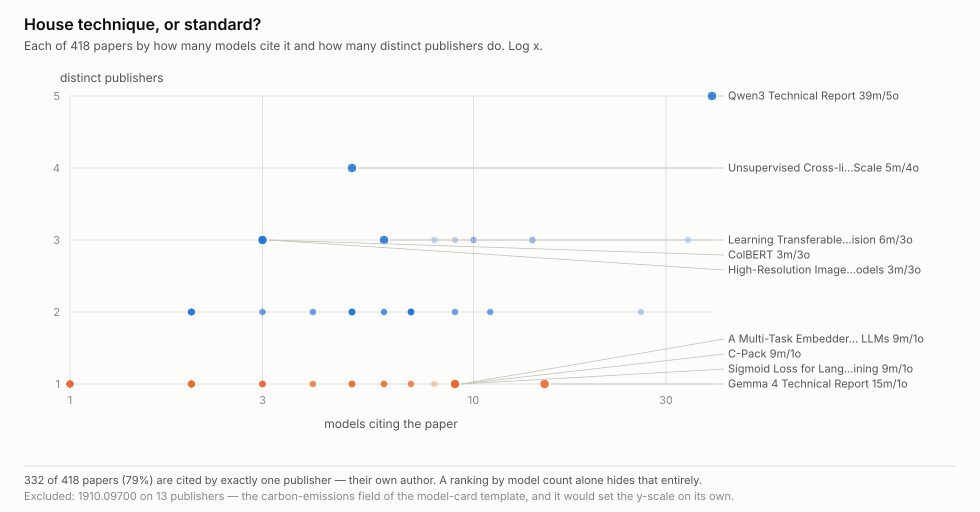
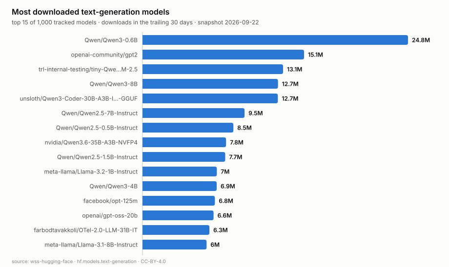
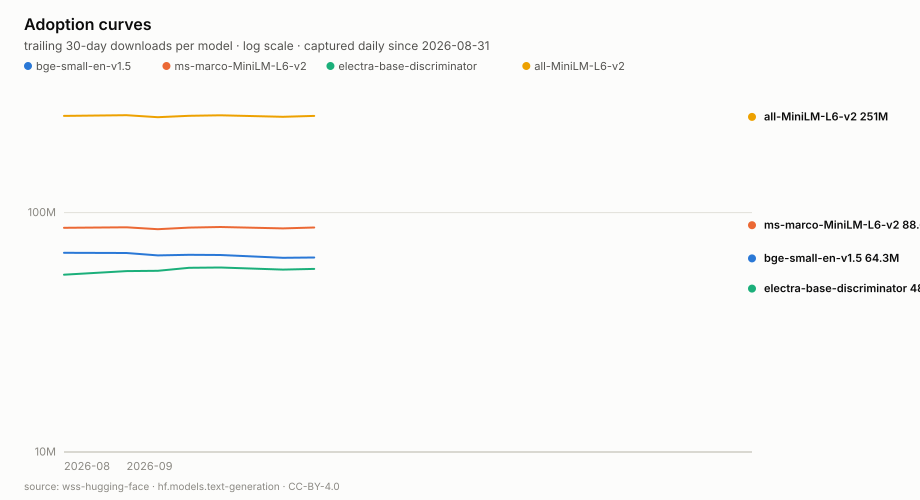

<h1 align="center">wss-hugging-face</h1>

<p align="center">
  <strong>What the open-model ecosystem is actually adopting, captured daily</strong>
</p>

<div align="center">

  <a href="https://github.com/q3dresearch/wss-hugging-face/actions/workflows/capture-daily.yml"></a>
  <a href="https://github.com/q3dresearch/wss-hugging-face/commits"></a>
  <a href="https://github.com/q3dresearch/wss-hugging-face/blob/main/LICENSE"></a>
  <a href="https://github.com/q3dresearch/wss-hugging-face"></a>

</div>

<p align="center">
  <sub>fleet: <a href="https://github.com/q3dresearch/wss-engine">engine</a> · <strong>hugging face</strong> · <a href="https://github.com/q3dresearch/wss-openrouter">openrouter</a> · <a href="https://github.com/q3dresearch/wss-cloud-footprint">cloud footprint</a> · <a href="https://github.com/q3dresearch/wss-mining-pipeline">mining</a> · <a href="https://github.com/q3dresearch/wss-forest-harvest">forest</a> · <a href="https://github.com/q3dresearch/wss-food-trace">food</a></sub>
</p>

The API shows a rolling 30-day download count and a running total. There is no
history endpoint, no window to page back through. So the day a model took off,
the week an idea spread from one paper into fifty models, is gone unless
somebody wrote it down. This repo writes it down.



**Adoption, not attention.** Citations measure academic interest; this counts
how many of the top 1,000 most-downloaded models carry each paper's `arxiv:`
tag. Model-family reports (Qwen3, 42) sit beside pure *technique* papers other
people chose to adopt — YaRN at 37, SigLIP at 10, the 2020 ViT paper still
shipping in 9.

**Every source, its live URL, its licence and its last stored capture is listed in [SOURCES.md](SOURCES.md)** — generated by `wss sources`, so it cannot drift from the registry.

## Questions this exists to answer

A source that answers no question gets dropped. A question nothing answers is
the next thing to build. Append freely.

| # | Question | Status |
| --- | --- | --- |
| Q1 | Which research ideas actually **ship**, as opposed to getting cited? | answered — see chart above |
| Q2 | Is one architecture displacing another in production, or only in discourse? | accruing (today: 716 transformers to 1 jamba) |
| Q3 | Of the models and datasets born each week, how many ever find users? | needs ~12 weeks |
| Q4 | Where do likes and trending diverge from downloads — hype versus use? | accruing |
| Q5 | Do certain datasets precede a wave of models built on them? | open — needs the dataset↔model link extracted |
| Q6 | Are daily-paper upvotes predictive of adoption, or uncorrelated? | accruing |

## What you can build

Charts come from [examples/visualize.py](examples/visualize.py) — stdlib only,
deterministic, no network.



**Today's leaderboard**, from the latest capture.



**Q2/Q3 — what months of this becomes:** overtakes, decay, and models that
die. Currently rendered from a synthetic stand-in (captioned as such) until
eight real capture days exist, then it switches to real history by itself.

Also derivable: rank-change feeds, hype-versus-usage gaps, birth-cohort
survival, and topic waves — the raw papers feed carries titles, abstracts and
keywords, so trend analysis needs no PDF downloads.

## Using it

**Reading this data needs nothing** — no key, no account, not even a clone:

```bash
B=https://raw.githubusercontent.com/q3dresearch/wss-hugging-face/main/derived/observations
duckdb -c "SELECT * FROM read_csv_auto('$B/2026-09.csv') LIMIT 5"
```

```bash
head derived/observations/*.csv          # one row per entity/metric/day
python examples/load_observations.py     # sqlite + example queries
python examples/visualize.py             # regenerate every chart
```

Columns are `series_id, entity_id, observed_at, captured_at, metric, value,
unit, source_id, raw_ref, parser_version`. Metrics: `downloads_30d`,
`downloads_all_time`, `likes`, `trending_score`, `upvotes`, `comments`, plus
aggregates `models_using`, `models_serving`, `models_implementing`. Every row
carries a `raw_ref` back to the exact archived response it was parsed from.

Ten daily sources — models and datasets by downloads / likes / trending /
newest, plus the daily-papers feed — each captured at the API's maximum size
and **unfiltered**, so slicing by task, library or tags happens at query time.
Coverage dates live in [health/health.csv](health/health.csv); more detail in
[docs/data-layout.md](docs/data-layout.md).

Captured daily at 22:10 UTC by the
[wss](https://github.com/q3dresearch/wss-engine) engine. No workflow names a
source.

## Contributing

**The test for a new source: which open question does it close?** If the
answer is "none", it does not go in — add the question first, or drop the
idea.

Adding one is a single file in `registry/`, plus a parser if the payload shape
is new. No workflow edits, ever.

One caveat worth knowing before you trust the `newest` streams: Hugging Face
sees roughly 3–5K model creations a day, more than one page, so those are a
consistent daily *sample* rather than a census. Fine for cohort comparison,
wrong for counting.

## Licences

Code MIT; data CC-BY-4.0, citation in [CITATION.cff](CITATION.cff). Captured
content originates from the Hugging Face Hub API and remains subject to
[their terms](https://huggingface.co/terms-of-service).

Topics: `git-scraping` · `open-data` · `point-in-time-data` · `dataset`
